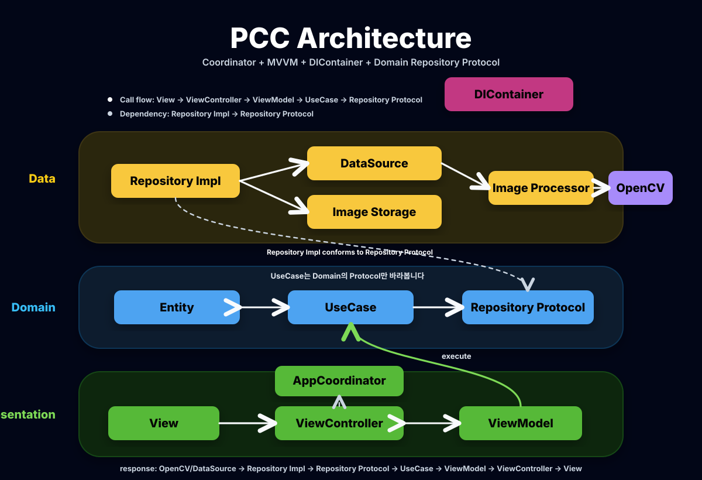

# PCC

## PCC: Photo Card Collector

> App Store: https://apps.apple.com/us/app/pcc-photo-card-collector/id6774027483

PCC는 포토카드를 바인더 단위로 관리하고, 촬영한 포토카드 이미지를 보정해 저장할 수 있는 iOS 앱입니다.

현재 앱 버전은 `1.0.2`이며, UIKit 기반으로 화면을 구성하고 `Coordinator`, `MVVM`, `DIContainer`를 사용해 화면 이동과 의존성 조립을 분리했습니다.

## 주요 기능

- 바인더 생성, 수정, 삭제
- 바인더별 포토카드 목록 관리
- 포토카드 이미지 추가 및 미리보기
- 포토카드 제목, 멤버, 카테고리 메타데이터 관리
- 카테고리와 멤버 목록 관리
- OpenCV 기반 포토카드 영역 추출 및 원근 보정
- Vision 기반 이미지 처리 fallback
- 한국어, 영어, 일본어 localization 리소스 구성
- Firebase Analytics, Crashlytics, Remote Config 연동 준비

## 기술 스택

- Swift
- UIKit
- MVVM
- Coordinator
- DIContainer
- CoreData
- SnapKit
- OpenCV
- Vision
- Firebase

## 프로젝트 구조

```text
PCC
├── App
│   ├── AppCoordinator.swift
│   ├── AppDIContainer.swift
│   ├── AppDelegate.swift
│   └── SceneDelegate.swift
├── Domain
│   ├── Entity
│   ├── Repository
│   └── UseCase
├── Data
│   ├── DataSource
│   └── Repository
└── Presentation
    ├── View
    ├── ViewController
    ├── ViewModel
    └── Support
```

## 아키텍처
> MVVM-C & Clean Architecture

PCC는 화면 이동 책임과 객체 생성 책임을 ViewController에서 분리하는 방향으로 구성했습니다.



- `AppCoordinator`는 앱의 화면 전환을 담당합니다.
- `AppDIContainer`는 ViewController, ViewModel, UseCase, Repository, DataSource를 조립합니다.
- ViewController는 사용자 입력을 받고 ViewModel과 바인딩하며, 화면 이동이 필요할 때 callback으로 Coordinator에 요청합니다.
- Domain 계층은 Entity, Repository Protocol, UseCase를 포함합니다.
- Data 계층은 local data source, image storage, image processor 구현체를 포함합니다.

이 구조를 통해 ViewController가 직접 다른 화면을 생성하거나 UseCase를 조립하지 않도록 했고, 기능이 늘어나도 화면 흐름과 의존성 구성이 한 곳에서 관리되도록 했습니다.

## 화면 구성

- `HomeViewController`: 바인더 목록
- `BinderDetailViewController`: 바인더 상세 및 포토카드 목록
- `BinderSettingViewController`: 바인더 생성/수정
- `AddPhotocardViewController`: 포토카드 이미지 추가
- `PhotocardPreviewViewController`: 포토카드 미리보기
- `PhotocardMetadataViewController`: 포토카드 메타데이터 수정
- `AppSettingViewController`: 앱 설정
- `StringListManagementViewController`: 카테고리/멤버 목록 관리

TableView, CollectionView, TextField 관련 `delegate`와 `dataSource` 구현은 각 ViewController 파일 하단의 extension으로 분리해 역할을 구분했습니다.
